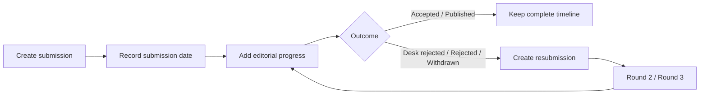
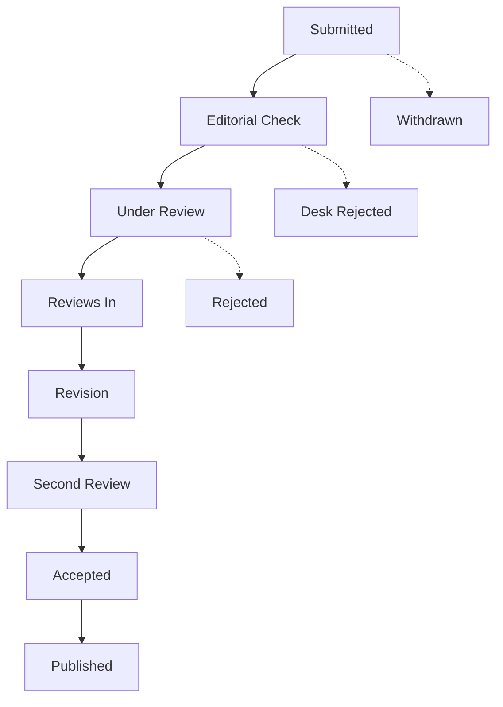

# Journal Submission Recorder

> A private, offline desktop app for tracking every journal submission, editorial stage, and resubmission in one place.

  

## Quick Start

1. Run `Journal Submission Recorder.exe`. No installation or internet connection is required.
2. Select **New submission** and enter the manuscript title, journal name, and submission date. You may also add a journal cover image.
3. In the submission details, select **Add progress** whenever the editorial status changes.
4. When a manuscript is rejected or withdrawn, select **Resubmit** to start the next round while retaining the complete history.

## Features

| Feature | Description |
| --- | --- |
| Journal details | Record journal names and optionally attach cover images. |
| Progress timeline | Track submission, editorial check, peer review, reviews received, revision, acceptance, rejection, and more. |
| Resubmission history | Group every round for the same manuscript without losing previous records. |
| Duplicate-submission alert | Receive a warning when a manuscript already has active submissions. |
| Search and filters | Search by manuscript or journal, and filter active or completed records. |
| Local backup | Export a JSON backup and restore it on another device. |
| Language switch | Starts in English; switch to Chinese at any time from the sidebar. |

## Available Submission Stages

Supported stages: `Submitted`, `Editorial Check`, `Desk Rejected`, `Under Review`, `Reviews In`, `Revision`, `Second Review`, `Accepted`, `Rejected`, `Withdrawn`, and `Published`.

## Data and Privacy

- All data is stored locally on the user's own device. Nothing is uploaded to a server.
- This sharing edition contains no sample submissions and no personal records from the publisher.
- Export a backup regularly using **Export backup** in the sidebar.
- To migrate to a different computer, copy the exported JSON file and use **Import backup** in the app.
- Deleting a submission cannot be undone. Export a backup first when needed.

## FAQ

**Does it need to be installed?**  
No. Copy the `.exe` file and run it directly.

**Why does Windows show an “Unknown publisher” notice?**  
This portable build does not use a commercial code-signing certificate. Only proceed after confirming that the file came from a source you trust.

**How do I move my records to another computer?**  
Export a JSON backup on the original device, then import it on the new device.

**Does deleting round 2 delete round 1?**  
No. Deletion applies only to the currently selected submission; other rounds remain intact.

---

Journal Submission Recorder · A traceable timeline for every submission.
